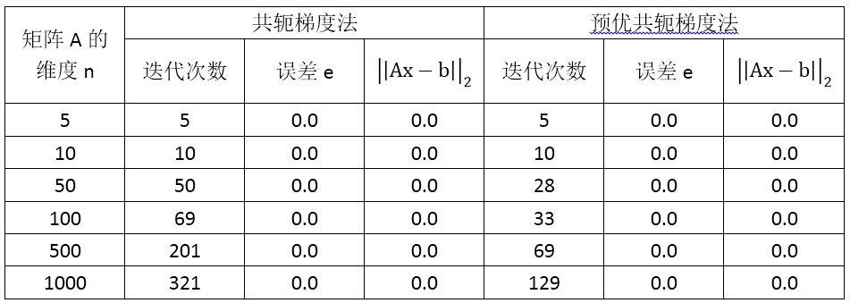
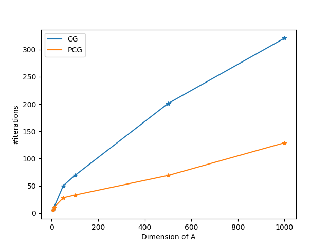

[TOC]

> 罗文锋 18214551

# 共轭梯度法和预优共轭梯度法

## 一、算法描述

### 共轭梯度法

迭代步骤如下：

1. 如果是第一次迭代，选取下降方向为梯度方向$p_0 = r_0 = b - Ax_0$

2. 否则，通过当前梯度$r_k = b - Ax_k$和上一时刻的下降放向$p_{k-1}$确定新的下降方向
   $$
   \beta_k = -\frac{r_{k+1}^TAp_k}{p^T_kAp_k}\\
   p_{k} = r_k+\beta_kp_{k-1}
   $$

3. 在确定下降方向以后，借鉴最速下降法的思路，求出步长$\alpha_k = \frac{r_k^Tp_k}{p_k^TAp_k}$

4. 更新，$x_{k+1} = x_k+\alpha_kp_k$

5. 判断梯度是否足够小，$\sqrt{r_k^Tr_k}<\epsilon$，如果是则结束迭代，否则回到第一步。

### 预优共轭梯度法

预优共轭梯度法的关键在于选取预优矩阵$M$，这里我们考虑选取$M$为由原始矩阵$A$的对角线元素组成的对角矩阵。

## 二、代码实现

- 环境：matlab2015，linux
- 共轭梯度法

```matlab
function [x, step] = conjugate_gradient(x, A, b, epsilon)
% Use conjugate gradient method to solve linear system Ax = b.
%
% Arguments
% ---------
% x       : initial value
% A, b    : Ax = b
% epsilon : scalar, a float number very close to 0, say 1e-7
%
% Returns
% -------
% x      : the answer for Ax = b
% step   : scalar, number of steps to reach x.

if nargin == 3
    epsilon = 1e-10;
end

n = length(A);
step = 0;
r = b - A*x;
rou_new = r'*r;
while step < n && sqrt(rou_new) > epsilon
    if step == 0
        p = r;
    else
        beta = rou_new / rou_old;
        p = r + beta * p;
    end
    Ap = A*p;
    alpha = (r'*p) / (p'*Ap);
    x = x + alpha * p;
    r = r - alpha * Ap;
    rou_old = rou_new;
    rou_new = r'*r;
    step = step + 1;
end
```

- 预优共轭梯度法

```matlab
function [x, step] = pre_conjugate_gradient(x, A, b, M, epsilon);
% Preconditioned conjugate gradient method
%
% Arguments
% ---------
% x        : initial value
% A, b     : Ax = b
% M        : preconditioned matrix
% epsilon  : scalar, a float number very close to 0.0, say 1e-7
%
% Returns
% -------
% x     : the answer for Ax = b
% step  : scalar, number of steps to reach x

if nargin == 4
    epsilon = 1e-10;
end

n = length(A);
step = 0;
r = b - A*x;
while step < n && sqrt(r'*r) > epsilon
	z = M \ r;
	if step == 0
		p = z;
		rou_new = r'*z;
	else
		rou = rou_new;
		rou_new = r'*z;
		beta = rou_new / rou;
		p = z + beta * p;
	end
	w = A * p;
	alpha = rou_new / (p'*w);
	x = x + alpha * p;
	r = r - alpha * w;
	step = step + 1;
end
```

- 测试代码

```matlab
clear;
epsilon = 1e-9;
n = 1000;
A = zeros(n, n);
b = ones(n, 1);
x0 = zeros(n, 1);

for k = 1:n
	A(k, k) = 2;
	if k < n
		A(k, k+1) = -3;
		A(k+1, k) = -3;
	end
end
big = diag((randi([0, 2], n, 1) - 1) * 100);
A = A + big;

% x0 = zeros(5, 1);
% A = [[100 3 0 0 0]; [3 200 3 0 0]; [0 3 300 3 0]; [0 0 3 200 3]; [0 0 0 3 150]];
% b = [1 1 1 1 1]';

xt = A \ b;
[xgd, tgd] = conjugate_gradient(x0, A, b, epsilon);
fprintf('Conjugate gradient\n');
fprintf('step = %d, error = %.8f, norm(Ax-b)=%.8f\n', tgd, relative_error(xt, xgd), norm(A*xgd - b, 2));

M = diag(diag(A));
[xpgd, tpgd] = pre_conjugate_gradient(x0, A, b, M, epsilon);
fprintf('Pre-conditioned conjugate gradient\n');
fprintf('step = %d, error = %.8f, norm(Ax-b)=%.8f\n', tpgd, relative_error(xt, xpgd), norm(A*xpgd - b, 2));
```

## 三、实验结果

### 设计带状矩阵A

首先设计如下带状矩阵：
$$
\hat{A} = \begin{bmatrix}
2 & 3 & 0 & 0 & \cdots & 0\\
3 & 2 & 3 & 0& \cdots & 0\\
0 & 3 & 2 & 3 & \cdots & 0 \\
0 & 0 & 3 & 2 &\cdots & 0 \\
\vdots & \vdots & \vdots & \vdots &\ddots &\vdots\\
0 & 0 & 0 & 0 & \cdots & 2
\end{bmatrix}\\
$$
为了增加矩阵的奇异性，对矩阵$\hat{A}$的对角线元素随机加上0, 100或-100，从而得到最终的矩阵$A$。另外，取$b = [1, 1, 1, \cdots, 1]^T$。

### 结果1

下面对$A$的不同维度做探究，得到如下表格



误差$e$定义如下：
$$
e = \max_{1\le i \le n}\frac{|x_i - xt_i|}{\max(|x_i|+|xt_i|, 1e^{-8})}
$$
其中$xt$为用matlab语言的内置左除计算结果`xt = A \ b`，而$x$为迭代算法的输出结果。

### 结果2

可视化上面的表格数据如下



### 结果3

下面给出求解如下矩阵的具体结果
$$
A = \begin{bmatrix}
100 & 3 & 0 & 0 & 0\\
3 & 200 & 3 & 0 & 0\\
0 & 3 & 300 & 3 & 0\\
0 & 0 & 3 & 200 & 3\\
0 & 0 & 0 & 3 & 150\\
\end{bmatrix}\\
$$
这里取维度$n=5$的矩阵$A$，$b = [1, 1, 1, 1, 1]^T$。分别使用`xt = A \ b`， 共轭梯度法和预优共轭梯度法的结果。

```matlab
xt   = [0.0099 0.0048 0.0032 0.0049] % xt = A \ b
xgd  = [0.0099 0.0048 0.0032 0.0049] % conjugate gradient
xpgd = [0.0099 0.0048 0.0032 0.0049] % preconditioned conjugate gradient
```


