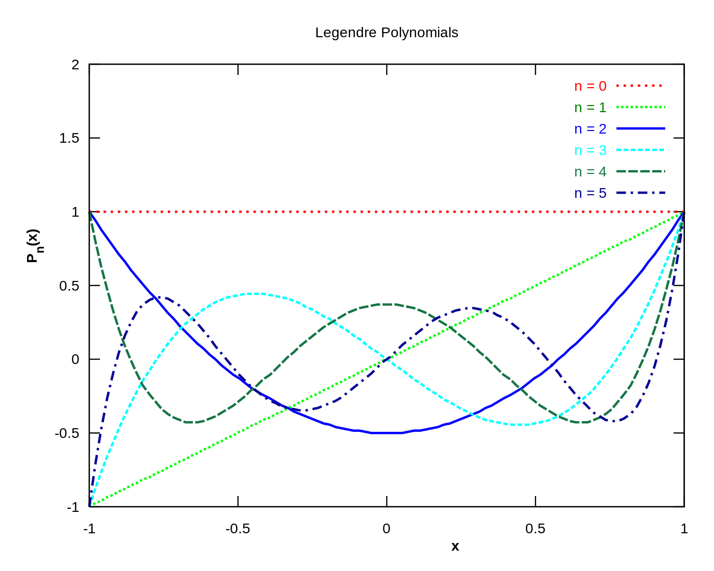

[TOC]

# 雅克比正交多项式

- 区间: $[a, b]$
- 权函数: $\rho (x) = \frac{(1-x)^\alpha}{(1+x)^\beta}$

雅克比多项式是盖根鲍尔多项式，勒让德多项式，泽尔尼克以及切比雪夫多项式的一般化形式。

## 一般形式

雅克比多项式的一般形式为：
$$
    P^{(\alpha, \beta)}_n(x) = \frac{\Gamma(\alpha+\beta+1)}{n!\Gamma(\alpha+\beta+n+1)}\sum_{m=0}^n
\left(
    \begin{array}{c}
      n \\
      m
    \end{array}
  \right)\frac{\Gamma(\alpha+\beta+n+m+1)}{\Gamma(\alpha+m+1)}\left(\frac{x-1}{2}\right)^m
$$
其中$\Gamma(x)$为伽马函数，定义为：
$$
\Gamma(x) =\int_0^\infin x^{z-1}e^{-x}dx
$$
当仅仅考虑实数域$x\in R$时，雅克比行列式可以等价地表示为：
$$
P^{(\alpha, \beta)}_n(x) = \sum_{s=0}^n
\left(
    \begin{array}{c}
      n+\alpha\\
      n - s
    \end{array}
  \right)
  \left(
    \begin{array}{c}
      n+\beta\\
       s
    \end{array}
  \right)
  \left(
\frac{x-1}{2}
  \right)^s
  \left(
\frac{x+1}{2}
  \right)^{n-s}
$$

## 种类

1. 勒让德多项式

   - 当$\alpha=\beta=0$时，权函数退化为$\rho(x)=1$，此时即为勒让德多项式

   - 罗德里格公式表示为：$P_n(x) = \frac{1}{2^nn!}\frac{d^n}{dx^n}[(x^2-1)^n]$

   - 前6阶的勒让德多项式曲线如下（图片取自[wiki](https://upload.wikimedia.org/wikipedia/commons/thumb/8/82/Legendre_poly.svg/1400px-Legendre_poly.svg.png))：

     

2. 切比雪夫多项式

   - 当$\alpha=-1, \beta=1$时，权函数为$\rho(x)=\frac{1}{1-x^2}$，此时即为切比雪夫多项式

   - 切比雪夫多项式由递推公式确定，$T_{n+1}(x) = 2xT_n(x)-T_{n-1}(x), T_0(x) = 1, T_1(x)=x$

   - 通项公式可以表示为，$T_n(x) = \cos n\theta$，其中$x=\theta, \theta\in[0, \pi]$.

     

3. 盖根鲍尔多项式

   - 当$\alpha=\beta$时，雅克比多项式降低了一个自由度，可将权函数写做$\rho(x)=(1 - x^2)^{\alpha-\frac{1}{2}}$（这里的$\alpha$与原来的不一样），盖根鲍尔多项式一般记为$C^\alpha_n(x)$

   - 盖根鲍尔多项式有递推公式：$C^\alpha_n(x) = \frac{1}{n}[2x(n+\alpha -1)C^\alpha_{n-1}(x)-(n + 2\alpha-2)C^\alpha_{n-2}(x)]$，前面两项分别为$C^\alpha_(x) = 1, C^\alpha_1(x)=2\alpha x$

     

## 与常微分方程的联系

雅克比多项式$P^{(\alpha, \beta)}_n(x)$是如下二阶齐次线性常微分方程的解：
$$
(1-x^2)y''+(\beta-\alpha-(\alpha+\beta+2)x)y'+n(n+\alpha+\beta+1)y=0
$$

## 零点

雅克比多项式的零点性质：

1. 正交多项式零点的一般特性：$P^{(\alpha, \beta)}_n(x) $在$[-1, 1]$上有$n$个单根。
2. $P^{(\alpha, \beta)}_n(x)$和$P^{(\alpha, \beta)_n(x)}$的零点彼此将对方分隔开来。
3. 如果$m<n$，那么在$P^{(\alpha, \beta)}_n(x)$的任意两个零点之间存在一个$P^{(\alpha, \beta)}_n(x)$的一个零点

## 参考文献

- [Jacobi polynomials from wiki](https://www.wikiwand.com/en/Jacobi_polynomials)
- [Properties of Zeros of Jacobi Polynormials](http://wiredspace.wits.ac.za/bitstream/handle/10539/18531/mastersmain.pdf?sequence=1&isAllowed=y)
- 